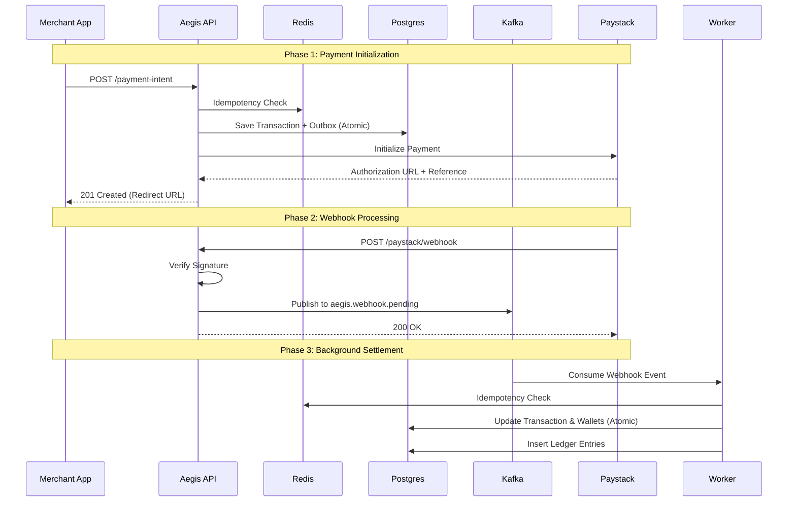

# Aegis Payment Flow

This document outlines the end-to-end payment orchestration flow using Paystack, Kafka, and a decoupled worker architecture.

## System Actors

| Actor | Description |
| :--- | :--- |
| **Customer** | Buyer on the merchant's platform |
| **Merchant App** | Storefront (e.g., Shopify, Amazon) calling Aegis API |
| **Aegis API** | Primary orchestration layer |
| **Redis** | Idempotency storage and distributed locks |
| **Postgres** | Primary source of truth (Transactions, Wallets, Ledger) |
| **Kafka** | Event bus for async decoupled processing |
| **PSP (Paystack)** | External Payment Service Provider |
| **Outbox Relay** | background service ensuring reliable message delivery |
| **Workers** | Independent domain consumers (Webhook, Balance, Ledger, etc.) |

---

## 1. Interaction Overview



---

## 2. Detailed Technical Steps

### Step 1: Payment Intent Creation
The Merchant App initiates a payment request.

**Endpoint:** `POST /api/v1/transactions/payment-intent`

<details>
<summary>View Request Payload</summary>

```json
{
  "amount": 10000, 
  "currency": "GHS",
  "email": "customer@example.com",
  "metadata": {
    "user_id": "m_123"
  },
  "idempotency_key": "order_abc_123"
}
```
</details>

1.  **Idempotency Check**: API checks Redis for `idempotency:key`. If found, returns the cached response.
2.  **Persistence**: API starts a Postgres transaction:
    -   Inserts record into `transactions` (status: `pending`).
    -   Inserts record into `transaction_outbox` (topic: `aegis.payment.created`).
3.  **PSP Initialization**: API calls Paystack `/transaction/initialize`.
    -   *Note: Aegis passes its internal `transaction_id` and `user_id` inside the Paystack metadata object.*
4.  **Response**: Returns the authorization URL to the Merchant App.

### Step 2: Reliable Event Delivery (Outbox Relay)
A dedicated background service ensures all database events reach Kafka.

1.  **Poll**: Scans `transaction_outbox` for `pending` events using `FOR UPDATE SKIP LOCKED`.
2.  **Publish**: Pushes records to the appropriate Kafka topic (e.g., `aegis.payment.created`).
3.  **Acknowledge**: Marks events as `processed` in the database after successful Kafka ACK.

### Step 3: Webhook Ingestion & Inflow
When the customer completes the payment, Paystack sends an asynchronous notification.

**Endpoint:** `POST /paystack/webhook`

1.  **Verification**: API computes HMAC-SHA512 of the body using the Paystack secret and compares it to the `x-paystack-signature` header.
2.  **Fast Path**: API publishes the raw body to the `aegis.webhook.pending` Kafka topic and returns `200 OK` immediately.
    -   *Partitioning: The `user_id` from metadata is used as the Kafka partition key to ensure sequential processing per user.*

### Step 4: Webhook Worker (Business Logic)
Consumes from `aegis.webhook.pending` to finalize the inflow.

1.  **Idempotency**: Checks Redis using the Paystack `reference`.
2.  **Atomic Update**: Starts a Postgres transaction:
    -   Sets `transactions.status = 'completed'`.
    -   Credits the Seller's `locked_balance` for the net amount.
    -   Credits the Platform's `balance` for the fee.
    -   Inserts triple-entry ledger records (External DEBIT, Seller CREDIT, Platform CREDIT).
3.  **Ledger Integrity**: `balance_after` is captured via the `RETURNING` clause to ensure the ledger matches the wallet state exactly.

---

## 3. Post-Processing (Planned)

### Settlement & Payout
The Payout Worker moves funds from `locked_balance` to `balance` after a predefined holding period or successful verification, then triggers the external transfer via Paystack.

### Reconciliation
A daily job sums all ledger entries for a user and compares the total against the current wallet balances (`balance + locked_balance`). Discrepancies trigger automated alerts.
