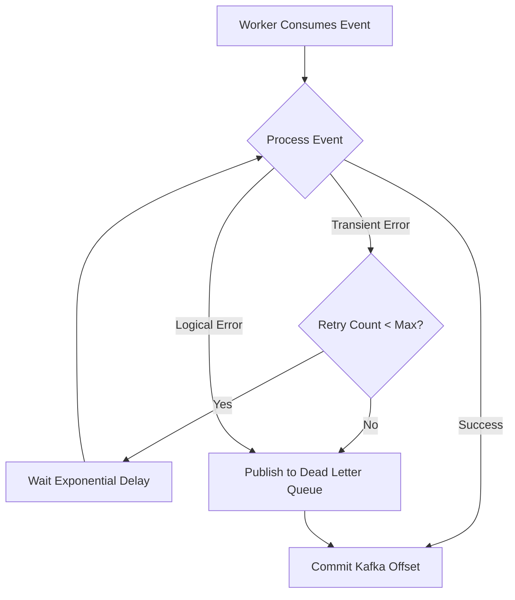

# Aegis System Reliability

This document defines the reliability patterns and failure handling strategies implemented within the Aegis ecosystem to ensure data integrity and high availability.

## Core Reliability Patterns

### 1. External Inflow Reliability (Webhook Outbox)
To ensure no external payment notification is lost, Aegis employs the Outbox pattern for webhook ingestion.

- **Persistence**: Upon receiving a webhook, the payload is immediately persisted to the `transaction_outbox` within a local database transaction.
- **Async Processing**: The Outbox Relay asynchronously delivers the webhook event to the `aegis.webhook.pending` Kafka topic.
- **Benefit**: Decouples the API from Kafka availability and ensures persistence before acknowledgment to the PSP.

### 2. Distributed Locking
To prevent race conditions during concurrent wallet updates (e.g., multiple webhooks for the same user or simultaneous payouts), the system utilizes Redis-based distributed locking.

- **Mechanism**: Workers must acquire a lock on `lock:wallet:{user_id}` before initiating a balance update transaction.
- **TTL**: Locks are short-lived (e.g., 10s) to prevent deadlocks in case of worker failure.
- **Atomic Release**: Locks are released using Lua scripts to ensure only the owner can unlock the resource.

### 3. Exponential Backoff
All background workers and the Outbox Relay implement exponential backoff for transient failures (e.g., network timeouts, PSP rate limits).

| Attempt | Delay | Description |
| :--- | :--- | :--- |
| 1 | 1s | First retry |
| 2 | 2s | Second retry |
| 3 | 4s | Third retry |
| 4 | 8s | Fourth retry |
| 5 | 16s | Fifth retry |
| 6 | - | Move to Dead Letter Queue (DLQ) |

### 4. Dead Letter Queue (DLQ)
Messages that fail after the maximum number of retries are moved to a Dead Letter Queue for manual inspection.

- **Storage**: Failed messages are published to the `aegis.dlq` topic.
- **Metadata**: DLQ messages include the original payload, failure reason, retry count, and timestamp.
- **Alerting**: Publication to the DLQ triggers an automated alert for the operations team.

---

## Failure Handling Workflow

---

## Operational Monitoring

### Circuit Breaker (Planned)
For external dependencies like Paystack, a circuit breaker pattern is used to prevent cascading failures.

- **Closed State**: Normal operation.
- **Open State**: If failure threshold is reached (e.g., 5 consecutive errors), the circuit opens, and subsequent calls fail fast without hitting the external service.
- **Half-Open**: After a cooldown period, a single request is allowed through to test the dependent service.

### Reconciliation
A daily automated job performs a "Total Integrity Check" by comparing the sum of all Ledger entries against the current Wallet balances. Any discrepancy is logged as a critical alert.
